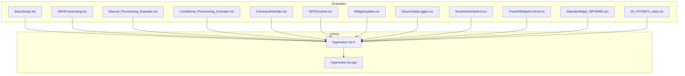
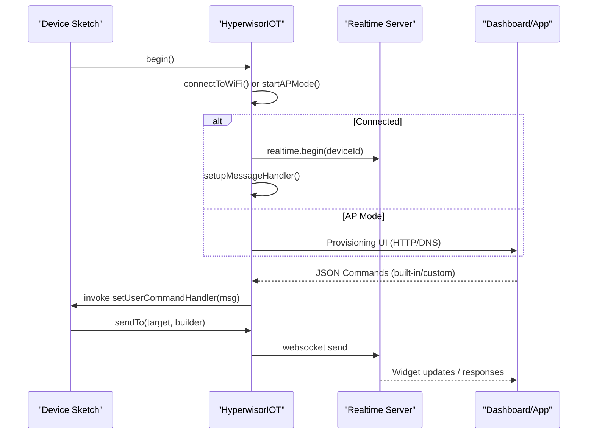
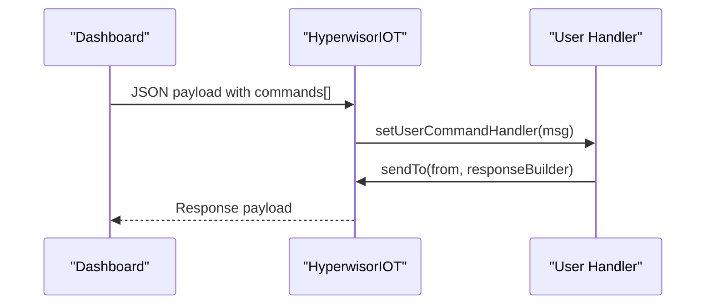
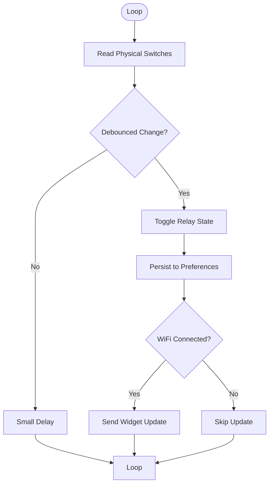
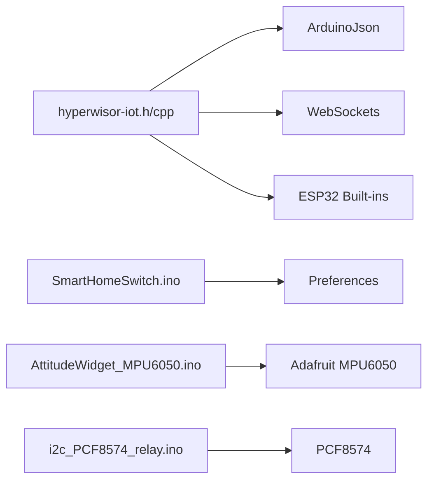

# Examples and Tutorials

<cite>
**Referenced Files in This Document**
- [README.md](file://README.md)
- [library.properties](file://library.properties)
- [hyperwisor-iot.h](file://src/hyperwisor-iot.h)
- [hyperwisor-iot.cpp](file://src/hyperwisor-iot.cpp)
- [BasicSetup.ino](file://examples/BasicSetup/BasicSetup.ino)
- [WiFiProvisioning.ino](file://examples/WiFiProvisioning/WiFiProvisioning.ino)
- [Manual_Provisioning_Example.ino](file://examples/Manual_Provisioning_Example/Manual_Provisioning_Example.ino)
- [Conditional_Provisioning_Example.ino](file://examples/Conditional_Provisioning_Example/Conditional_Provisioning_Example.ino)
- [CommandHandler.ino](file://examples/CommandHandler/CommandHandler.ino)
- [GPIOControl.ino](file://examples/GPIOControl/GPIOControl.ino)
- [WidgetUpdate.ino](file://examples/WidgetUpdate/WidgetUpdate.ino)
- [SensorDataLogger.ino](file://examples/SensorDataLogger/SensorDataLogger.ino)
- [SmartHomeSwitch.ino](file://examples/SmartHomeSwitch/SmartHomeSwitch.ino)
- [ThreeDWidgetControl.ino](file://examples/ThreeDWidgetControl/ThreeDWidgetControl.ino)
- [AttitudeWidget_MPU6050.ino](file://examples/AttitudeWidget_MPU6050/AttitudeWidget_MPU6050.ino)
- [i2c_PCF8574_relay.ino](file://examples/i2c_PCF8574_relay/i2c_PCF8574_relay.ino)
</cite>

## Table of Contents
1. [Introduction](#introduction)
2. [Project Structure](#project-structure)
3. [Core Components](#core-components)
4. [Architecture Overview](#architecture-overview)
5. [Detailed Component Analysis](#detailed-component-analysis)
6. [Dependency Analysis](#dependency-analysis)
7. [Performance Considerations](#performance-considerations)
8. [Troubleshooting Guide](#troubleshooting-guide)
9. [Conclusion](#conclusion)
10. [Appendices](#appendices)

## Introduction
This document provides a comprehensive, hands-on guide to implementing practical examples with the Hyperwisor-IOT Arduino library for ESP32. It covers foundational setups, command handling, widget updates, and advanced use cases such as smart home switching, sensor logging, 3D visualization, and I2C relay control. Each example includes step-by-step implementation walkthroughs, expected behaviors, integration guidance with sensors/actuators/cloud services, troubleshooting tips, and performance optimization advice.

## Project Structure
The repository organizes examples by feature area and the core library header/source files. The examples demonstrate:
- Basic connectivity and provisioning
- Command parsing and custom handlers
- Widget updates for dashboards
- Sensor logging and 3D model control
- Smart home switching and I2C relay control
- Attitude visualization using IMU sensors

**Diagram sources**
- [hyperwisor-iot.h](file://src/hyperwisor-iot.h#L1-L190)
- [hyperwisor-iot.cpp](file://src/hyperwisor-iot.cpp#L1-L800)
- [BasicSetup.ino](file://examples/BasicSetup/BasicSetup.ino#L1-L39)
- [WiFiProvisioning.ino](file://examples/WiFiProvisioning/WiFiProvisioning.ino#L1-L58)
- [Manual_Provisioning_Example.ino](file://examples/Manual_Provisioning_Example/Manual_Provisioning_Example.ino#L1-L65)
- [Conditional_Provisioning_Example.ino](file://examples/Conditional_Provisioning_Example/Conditional_Provisioning_Example.ino#L1-L69)
- [CommandHandler.ino](file://examples/CommandHandler/CommandHandler.ino#L1-L96)
- [GPIOControl.ino](file://examples/GPIOControl/GPIOControl.ino#L1-L105)
- [WidgetUpdate.ino](file://examples/WidgetUpdate/WidgetUpdate.ino#L1-L68)
- [SensorDataLogger.ino](file://examples/SensorDataLogger/SensorDataLogger.ino#L1-L77)
- [SmartHomeSwitch.ino](file://examples/SmartHomeSwitch/SmartHomeSwitch.ino#L1-L328)
- [ThreeDWidgetControl.ino](file://examples/ThreeDWidgetControl/ThreeDWidgetControl.ino#L1-L85)
- [AttitudeWidget_MPU6050.ino](file://examples/AttitudeWidget_MPU6050/AttitudeWidget_MPU6050.ino#L1-L95)
- [i2c_PCF8574_relay.ino](file://examples/i2c_PCF8574_relay/i2c_PCF8574_relay.ino#L1-L116)

**Section sources**
- [README.md](file://README.md#L1-L173)
- [library.properties](file://library.properties#L1-L11)

## Core Components
This section highlights the core capabilities exposed by the library and how the examples leverage them.

- Initialization and provisioning
  - begin(): Initializes WiFi and real-time connection; falls back to AP mode if no credentials are found.
  - AP mode provisioning via embedded HTTP server and DNS redirection.
  - Manual provisioning helpers: setCredentials(), setWiFiCredentials(), setDeviceId(), setUserId(), clearCredentials(), hasCredentials().
- Real-time messaging
  - setUserCommandHandler(): registers a user-defined callback to process custom commands.
  - sendTo(): sends structured JSON payloads to a target.
  - setupMessageHandler(): processes built-in commands (e.g., GPIO_MANAGEMENT, OTA, DEVICE_STATUS).
- Widget APIs
  - updateWidget(): updates dashboard widgets with string, numeric, or array values.
  - updateFlightAttitude(): updates a flight attitude meter.
  - updateWidgetPosition(): adjusts widget layout.
  - updateCountdown(): updates countdown timers.
  - updateHeatMap(): updates heat map data.
  - update3DModel()/update3DWidget(): controls 3D models and materials.
- Sensor and data logging
  - send_Sensor_Data_logger(): logs sensor data with a configId and structured values.
- GPIO state management
  - saveGPIOState(), loadGPIOState(), restoreAllGPIOStates(): persist GPIO states across reboots.
- Time and NTP
  - initNTP(), setTimezone(), getNetworkTime()/getNetworkDate()/getNetworkDateTime(): manage time.
- Database and cloud operations
  - setApiKeys(), insertDatainDatabase()/insertDatainDatabaseWithResponse(), onboardDevice()/onboardDeviceWithResponse(), authenticateUser()/authenticateUserWithResponse(), sendSMS()/sendSMSWithResponse(): integrate with backend services.

**Section sources**
- [hyperwisor-iot.h](file://src/hyperwisor-iot.h#L39-L187)
- [hyperwisor-iot.cpp](file://src/hyperwisor-iot.cpp#L13-L137)
- [hyperwisor-iot.cpp](file://src/hyperwisor-iot.cpp#L313-L405)
- [hyperwisor-iot.cpp](file://src/hyperwisor-iot.cpp#L521-L714)
- [hyperwisor-iot.cpp](file://src/hyperwisor-iot.cpp#L730-L800)

## Architecture Overview
The examples follow a consistent pattern:
- Device initialization with begin() and continuous loop() maintenance.
- Optional AP provisioning for first-time setup.
- Real-time message handling via WebSocket; built-in and user-defined commands.
- Dashboard widget updates and sensor data logging.
- Advanced integrations with sensors, actuators, and cloud services.

**Diagram sources**
- [hyperwisor-iot.cpp](file://src/hyperwisor-iot.cpp#L13-L137)
- [hyperwisor-iot.cpp](file://src/hyperwisor-iot.cpp#L313-L405)
- [CommandHandler.ino](file://examples/CommandHandler/CommandHandler.ino#L25-L85)
- [WidgetUpdate.ino](file://examples/WidgetUpdate/WidgetUpdate.ino#L44-L66)

## Detailed Component Analysis

### BasicSetup Tutorial
- Purpose: Minimal working example to initialize the device and maintain connectivity.
- Steps:
  1. Include the library and instantiate the device object.
  2. Call begin() in setup(); it will attempt saved credentials or start AP provisioning.
  3. Call loop() continuously to keep connections alive.
- Expected behavior:
  - On first boot without credentials, device starts AP mode and serves a provisioning page.
  - After successful provisioning, device connects to WiFi and initializes real-time communication.
- Circuit considerations:
  - No external components required; relies on ESP32’s integrated radio and flash storage.
- Adaptation guidelines:
  - Replace placeholder IDs in later examples with actual target/widget IDs from your dashboard.

**Section sources**
- [BasicSetup.ino](file://examples/BasicSetup/BasicSetup.ino#L1-L39)
- [hyperwisor-iot.cpp](file://src/hyperwisor-iot.cpp#L13-L137)

### WiFi Provisioning Flow
- Purpose: Demonstrate AP provisioning and credential lifecycle.
- Steps:
  1. Check hasCredentials() to determine provisioning state.
  2. If missing, device starts AP mode and serves a provisioning page.
  3. After saving credentials, device restarts and connects automatically.
- Expected behavior:
  - AP mode times out after a period and reboots to prevent stuck states.
  - Provisioning success/error pages return to the app via deep link.
- Troubleshooting:
  - If AP mode persists, verify provisioning form submission and credentials storage.
  - Ensure the device can reach the internet post-provisioning for real-time features.

**Section sources**
- [WiFiProvisioning.ino](file://examples/WiFiProvisioning/WiFiProvisioning.ino#L1-L58)
- [hyperwisor-iot.cpp](file://src/hyperwisor-iot.cpp#L141-L185)

### Manual Provisioning
- Purpose: Pre-configure credentials and optional API keys programmatically.
- Steps:
  1. Use setCredentials() to write SSID, password, device ID, and optional user ID.
  2. Optionally call setApiKeys() for backend operations.
  3. Call begin() to connect immediately.
- Expected behavior:
  - Device boots directly into STA mode without AP provisioning.
  - Useful for factory-fresh or locked-down deployments.

**Section sources**
- [Manual_Provisioning_Example.ino](file://examples/Manual_Provisioning_Example/Manual_Provisioning_Example.ino#L1-L65)
- [hyperwisor-iot.cpp](file://src/hyperwisor-iot.cpp#L432-L518)

### Conditional Provisioning
- Purpose: Combine manual and automatic provisioning for flexible deployments.
- Steps:
  1. Detect missing credentials at startup.
  2. Optionally set manual credentials for first boot.
  3. Initialize device; fallback to AP mode if manual provisioning is disabled.
- Expected behavior:
  - Provides a graceful fallback strategy for diverse deployment scenarios.

**Section sources**
- [Conditional_Provisioning_Example.ino](file://examples/Conditional_Provisioning_Example/Conditional_Provisioning_Example.ino#L1-L69)

### CommandHandler for Custom Command Processing
- Purpose: Receive and process custom commands from the dashboard/app.
- Steps:
  1. Register a user command handler with setUserCommandHandler().
  2. Parse payload.commands[] and handle custom command/action pairs.
  3. Use sendTo() to respond to the sender.
- Expected behavior:
  - Built-in commands (e.g., GPIO_MANAGEMENT, OTA, DEVICE_STATUS) are handled automatically; custom commands are routed to your handler.
- Integration tips:
  - Use findCommand()/findAction()/findParams() helpers to simplify parsing.

**Diagram sources**
- [hyperwisor-iot.cpp](file://src/hyperwisor-iot.cpp#L313-L405)
- [CommandHandler.ino](file://examples/CommandHandler/CommandHandler.ino#L25-L85)

**Section sources**
- [CommandHandler.ino](file://examples/CommandHandler/CommandHandler.ino#L1-L96)
- [hyperwisor-iot.h](file://src/hyperwisor-iot.h#L142-L146)

### WidgetUpdate Demonstrations
- Purpose: Update dashboard widgets with various data types.
- Steps:
  1. In loop(), periodically compute or simulate values.
  2. Call updateWidget(targetId, widgetId, value) with:
     - String values (e.g., “XX.X%”)
     - Numeric values (float/int)
     - Array values (for charts/graphs)
- Expected behavior:
  - Widgets reflect live updates; arrays render as series data.
- Integration tips:
  - Use a fixed update interval to balance responsiveness and bandwidth.

**Section sources**
- [WidgetUpdate.ino](file://examples/WidgetUpdate/WidgetUpdate.ino#L1-L68)
- [hyperwisor-iot.cpp](file://src/hyperwisor-iot.cpp#L551-L598)

### SmartHomeSwitch for Complex Hardware Control
- Purpose: Bidirectional control of relays with offline persistence and online synchronization.
- Hardware:
  - 7 relays on GPIO pins 32, 33, 27, 19, 18, 25, 26.
  - 7 physical switches on GPIO pins 36, 39, 34, 35, 4, 5, 23 with debouncing.
- Steps:
  1. Initialize relay pins and restore previous states from Preferences.
  2. Set up user command handler to process RELAY_CONTROL and widget-based commands.
  3. Handle physical switch presses with debouncing and toggle relay states.
  4. Persist relay states to Preferences and optionally push updates to the dashboard.
- Expected behavior:
  - Power loss resume restores relay states.
  - Cloud and local control are synchronized.
- Circuit considerations:
  - Ensure proper relay wiring and flyback diodes for inductive loads.
- Integration tips:
  - Map widget IDs to relay numbers dynamically for dashboard control.

**Diagram sources**
- [SmartHomeSwitch.ino](file://examples/SmartHomeSwitch/SmartHomeSwitch.ino#L241-L327)

**Section sources**
- [SmartHomeSwitch.ino](file://examples/SmartHomeSwitch/SmartHomeSwitch.ino#L1-L328)
- [hyperwisor-iot.cpp](file://src/hyperwisor-iot.cpp#L64-L137)

### SensorDataLogger for Sensor Integration
- Purpose: Periodically log sensor readings to the platform for visualization.
- Steps:
  1. In loop(), at a fixed interval, read simulated or real sensors.
  2. Call send_Sensor_Data_logger(targetId, configId, {{"key", value}, ...}).
- Expected behavior:
  - Structured sensor data appears in charts/graphs on the dashboard.
- Integration tips:
  - Use realistic sensor drivers (e.g., I2C/Temperature/Humidity) and calibrate values.

**Section sources**
- [SensorDataLogger.ino](file://examples/SensorDataLogger/SensorDataLogger.ino#L1-L77)
- [hyperwisor-iot.cpp](file://src/hyperwisor-iot.cpp#L535-L549)

### ThreeDWidgetControl for 3D Visualization
- Purpose: Control multiple 3D models within a 3D Widget (position, rotation, scale, material).
- Steps:
  1. Prepare a vector of ThreeDModelUpdate structures.
  2. Populate modelId, position[], rotation[], scale[], and material properties.
  3. Call update3DWidget(targetId, widgetId, updates) periodically.
- Expected behavior:
  - Models animate independently with different transforms and materials.
- Integration tips:
  - Use small update intervals to keep motion smooth; throttle when off Wi-Fi.

**Section sources**
- [ThreeDWidgetControl.ino](file://examples/ThreeDWidgetControl/ThreeDWidgetControl.ino#L1-L85)
- [hyperwisor-iot.h](file://src/hyperwisor-iot.h#L24-L35)
- [hyperwisor-iot.cpp](file://src/hyperwisor-iot.cpp#L686-L714)

### AttitudeWidgetControl with MPU6050
- Purpose: Drive a Flight Attitude Widget using accelerometer/gyroscope data.
- Steps:
  1. Initialize I2C and MPU6050 with custom SDA/SCL pins.
  2. In loop(), at a fixed interval, read acceleration and compute roll/pitch.
  3. Call updateFlightAttitude(targetId, widgetId, roll, pitch).
- Expected behavior:
  - Dashboard displays real-time attitude visualization.
- Integration tips:
  - Calibrate sensor offsets and filter noise for stable readings.

**Section sources**
- [AttitudeWidget_MPU6050.ino](file://examples/AttitudeWidget_MPU6050/AttitudeWidget_MPU6050.ino#L1-L95)

### I2C Relay Control Implementation (PCF8574)
- Purpose: Control I2C expanders (e.g., PCF8574) via real-time commands.
- Steps:
  1. Initialize I2C and PCF8574 expander with desired pin modes.
  2. Set API keys for backend operations (if needed).
  3. Register a user command handler to parse Control_Relay commands and act on Relay_1_ON/OFF and Relay_2_ON/OFF actions.
  4. Toggle expander pins to control relays.
- Expected behavior:
  - Dashboard can remotely turn relays on/off; device responds to commands.
- Integration tips:
  - Ensure correct I2C pull-ups and address selection; verify expander wiring.

**Section sources**
- [i2c_PCF8574_relay.ino](file://examples/i2c_PCF8574_relay/i2c_PCF8574_relay.ino#L1-L116)

## Dependency Analysis
- Library dependencies:
  - ArduinoJson: JSON serialization/deserialization for payloads.
  - WebSockets: Real-time communication channel.
  - ESP32 built-ins: WiFi, WebServer, HTTPClient, Preferences, Update, DNSServer, Wire.
- Example dependencies:
  - SmartHomeSwitch: Preferences for GPIO state persistence.
  - AttitudeWidget_MPU6050: Adafruit MPU6050 and Adafruit Sensor libraries.
  - i2c_PCF8574_relay: PCF8574 library and Wire.

**Diagram sources**
- [library.properties](file://library.properties#L10-L11)
- [SmartHomeSwitch.ino](file://examples/SmartHomeSwitch/SmartHomeSwitch.ino#L20-L24)
- [AttitudeWidget_MPU6050.ino](file://examples/AttitudeWidget_MPU6050/AttitudeWidget_MPU6050.ino#L13-L17)
- [i2c_PCF8574_relay.ino](file://examples/i2c_PCF8574_relay/i2c_PCF8574_relay.ino#L1-L6)

**Section sources**
- [library.properties](file://library.properties#L10-L11)

## Performance Considerations
- Keep loop() lightweight:
  - Use non-blocking delays and periodic timers for updates.
  - Throttle widget updates and sensor reads to reduce bandwidth and CPU usage.
- Optimize real-time reconnections:
  - The library automatically retries WebSocket connections; avoid frequent restarts.
- Memory management:
  - Prefer stack-local buffers for small payloads; use DynamicJsonDocument for larger ones.
- I2C and sensors:
  - Use appropriate pull-up resistors and bus speeds; debounce mechanical switches.
- OTA and provisioning:
  - Limit OTA triggers to necessary updates; ensure stable Wi-Fi during transfers.

[No sources needed since this section provides general guidance]

## Troubleshooting Guide
- Device stuck in AP mode:
  - Cause: Provisioning page not submitted or credentials not saved.
  - Resolution: Complete provisioning via the app; verify credentials with hasCredentials().
- No real-time connectivity:
  - Cause: Wi-Fi disconnect or WebSocket errors.
  - Resolution: Check network credentials, router availability, and serial logs for reconnection attempts.
- Widget updates not appearing:
  - Cause: Incorrect targetId/widgetId or missing dashboard configuration.
  - Resolution: Confirm IDs match dashboard definitions; ensure device is online.
- GPIO state not persisting:
  - Cause: Missing Preferences initialization or incorrect pin usage.
  - Resolution: Initialize Preferences before use; verify saveGPIOState() calls after state changes.
- 3D widget anomalies:
  - Cause: Invalid model IDs or malformed material properties.
  - Resolution: Validate modelId strings and numeric ranges for position/rotation/scale.
- I2C relay not responding:
  - Cause: Wrong I2C address, missing pull-ups, or incorrect pin modes.
  - Resolution: Verify expander address and wiring; confirm pin directions and logic levels.

**Section sources**
- [hyperwisor-iot.cpp](file://src/hyperwisor-iot.cpp#L46-L137)
- [WiFiProvisioning.ino](file://examples/WiFiProvisioning/WiFiProvisioning.ino#L27-L52)
- [SmartHomeSwitch.ino](file://examples/SmartHomeSwitch/SmartHomeSwitch.ino#L118-L149)

## Conclusion
The Hyperwisor-IOT library simplifies ESP32 IoT development by handling provisioning, real-time communication, and dashboard integrations out of the box. These examples demonstrate how to progressively build from basic connectivity to advanced hardware control, sensor logging, and 3D visualization. By following the step-by-step guides, applying the troubleshooting tips, and optimizing for performance, you can adapt these patterns to a wide range of applications and integrate seamlessly with third-party sensors, actuators, and cloud services.

[No sources needed since this section summarizes without analyzing specific files]

## Appendices

### Integration Patterns with Third-Party Sensors, Actuators, and Cloud Services
- Sensors:
  - Use established libraries (e.g., Adafruit sensor suites) and feed values into updateWidget() or send_Sensor_Data_logger().
- Actuators:
  - Relay modules, motor drivers, and solenoids can be controlled via GPIO or I2C expanders; persist states and synchronize with dashboard widgets.
- Cloud services:
  - Use setApiKeys() and database/cloud APIs to store and retrieve data; authenticate users and onboard devices as needed.

[No sources needed since this section provides general guidance]