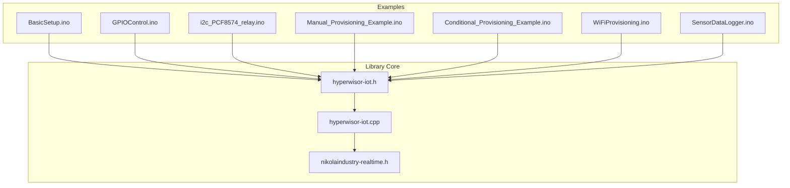
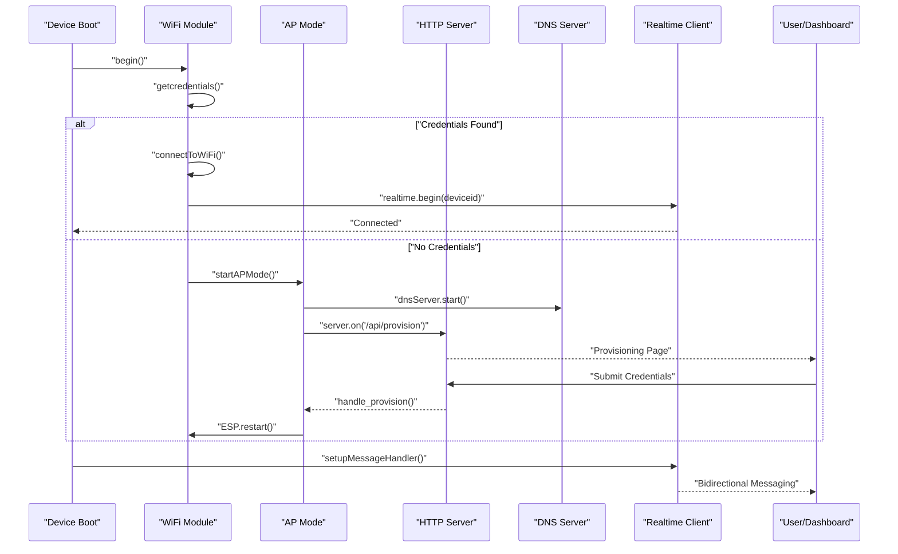
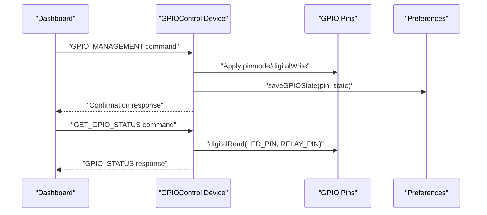
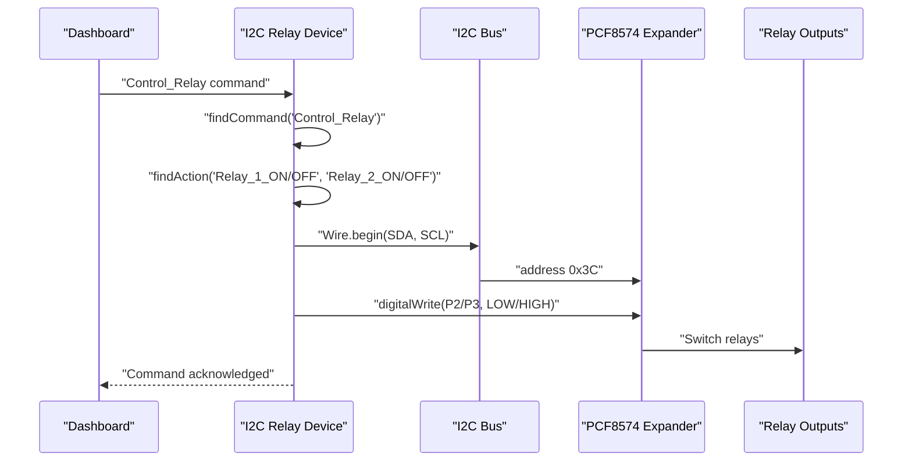
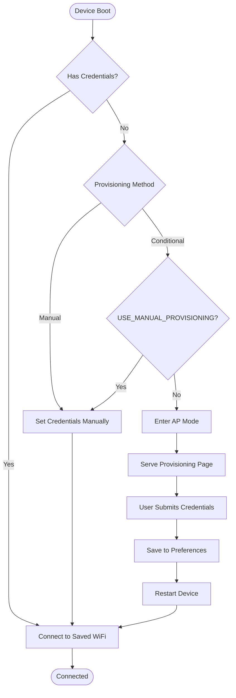
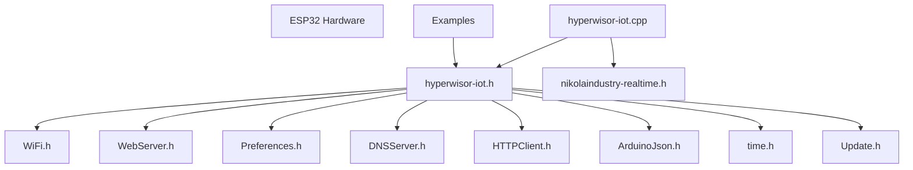
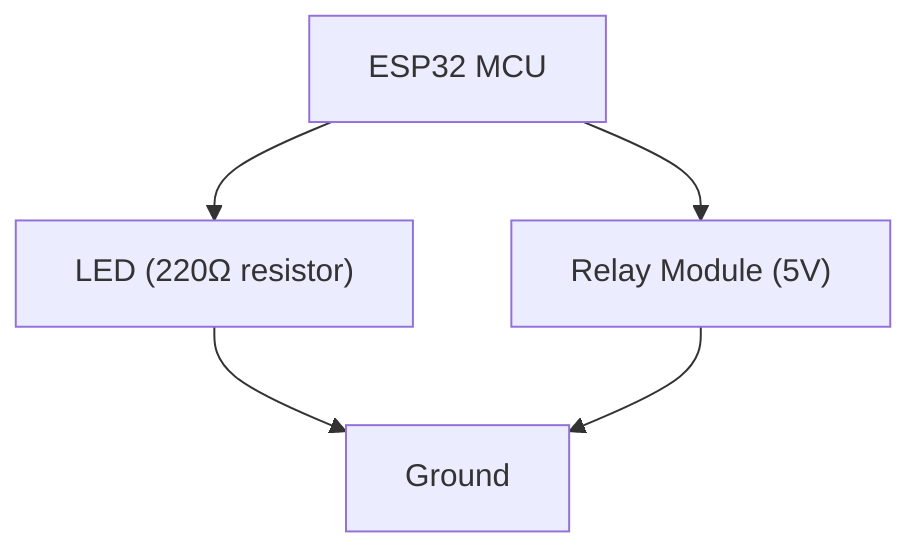
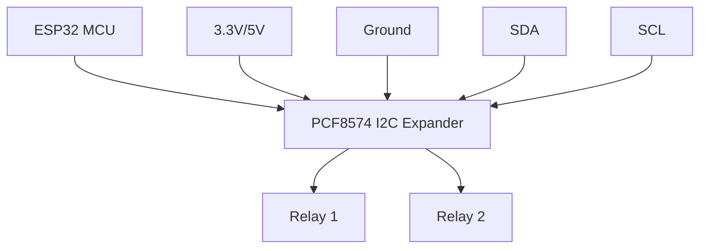
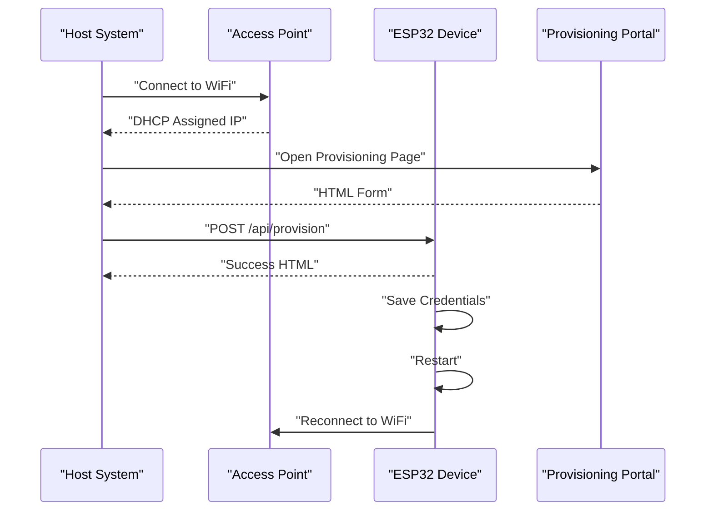

# Hardware Control Examples

<cite>
**Referenced Files in This Document**
- [README.md](file://README.md)
- [library.properties](file://library.properties)
- [hyperwisor-iot.h](file://src/hyperwisor-iot.h)
- [hyperwisor-iot.cpp](file://src/hyperwisor-iot.cpp)
- [BasicSetup.ino](file://examples/BasicSetup/BasicSetup.ino)
- [GPIOControl.ino](file://examples/GPIOControl/GPIOControl.ino)
- [i2c_PCF8574_relay.ino](file://examples/i2c_PCF8574_relay/i2c_PCF8574_relay.ino)
- [Manual_Provisioning_Example.ino](file://examples/Manual_Provisioning_Example/Manual_Provisioning_Example.ino)
- [Conditional_Provisioning_Example.ino](file://examples/Conditional_Provisioning_Example/Conditional_Provisioning_Example.ino)
- [WiFiProvisioning.ino](file://examples/WiFiProvisioning/WiFiProvisioning.ino)
- [SensorDataLogger.ino](file://examples/SensorDataLogger/SensorDataLogger.ino)
</cite>

## Table of Contents
1. [Introduction](#introduction)
2. [Project Structure](#project-structure)
3. [Core Components](#core-components)
4. [Architecture Overview](#architecture-overview)
5. [Detailed Component Analysis](#detailed-component-analysis)
6. [Dependency Analysis](#dependency-analysis)
7. [Performance Considerations](#performance-considerations)
8. [Troubleshooting Guide](#troubleshooting-guide)
9. [Conclusion](#conclusion)
10. [Appendices](#appendices)

## Introduction
This document provides comprehensive documentation for hardware control and provisioning examples in the Hyperwisor-IOT Arduino library. It focuses on practical IoT device implementation patterns, covering:
- GPIOControl: direct pin manipulation, input/output handling, and hardware abstraction techniques
- i2c_PCF8574_relay: I2C communication protocols, external hardware integration, and relay control mechanisms
- WiFi provisioning: manual and conditional provisioning workflows, AP mode configuration, and captive portal functionality

The guide includes circuit schematics, component selection guidelines, wiring diagrams, timing diagrams, signal characteristics, electrical safety considerations, and integration patterns for sensors, actuators, and peripherals commonly used in IoT applications.

## Project Structure
The repository organizes examples by functional area, with each example demonstrating a specific aspect of hardware control and provisioning. The core library resides under src/, while examples are located under examples/.

**Diagram sources**
- [hyperwisor-iot.h](file://src/hyperwisor-iot.h#L1-L190)
- [hyperwisor-iot.cpp](file://src/hyperwisor-iot.cpp#L1-L200)
- [BasicSetup.ino](file://examples/BasicSetup/BasicSetup.ino#L1-L39)
- [GPIOControl.ino](file://examples/GPIOControl/GPIOControl.ino#L1-L105)
- [i2c_PCF8574_relay.ino](file://examples/i2c_PCF8574_relay/i2c_PCF8574_relay.ino#L1-L116)
- [Manual_Provisioning_Example.ino](file://examples/Manual_Provisioning_Example/Manual_Provisioning_Example.ino#L1-L65)
- [Conditional_Provisioning_Example.ino](file://examples/Conditional_Provisioning_Example/Conditional_Provisioning_Example.ino#L1-L69)
- [WiFiProvisioning.ino](file://examples/WiFiProvisioning/WiFiProvisioning.ino#L1-L58)
- [SensorDataLogger.ino](file://examples/SensorDataLogger/SensorDataLogger.ino#L1-L77)

**Section sources**
- [README.md](file://README.md#L1-L173)
- [library.properties](file://library.properties#L1-L11)

## Core Components
The Hyperwisor-IOT library provides a unified interface for:
- WiFi provisioning and AP mode fallback
- Real-time communication via nikolaindustry-realtime
- GPIO management with persistence
- OTA firmware updates
- Widget updates and data logging
- Time and date functions with NTP

Key capabilities include:
- Automatic Wi-Fi connection using stored credentials
- AP-mode fallback with web-based provisioning page
- Structured JSON command parsing with custom extensibility
- GPIO control via commands (pinMode, digitalWrite)
- Continuous background loop with real-time and HTTP handling
- User command handler support via lambda functions
- Built-in DNS redirection when in AP mode
- Smart command routing via from → sendTo() pairing
- Preferences-based persistent storage

**Section sources**
- [README.md](file://README.md#L22-L36)
- [hyperwisor-iot.h](file://src/hyperwisor-iot.h#L46-L146)
- [hyperwisor-iot.cpp](file://src/hyperwisor-iot.cpp#L12-L137)

## Architecture Overview
The library architecture integrates Wi-Fi connectivity, AP provisioning, real-time messaging, and hardware control into a cohesive system. The following diagram illustrates the high-level flow from initialization to runtime operation.

**Diagram sources**
- [hyperwisor-iot.cpp](file://src/hyperwisor-iot.cpp#L13-L137)
- [hyperwisor-iot.cpp](file://src/hyperwisor-iot.cpp#L141-L185)

## Detailed Component Analysis

### GPIOControl Example
The GPIOControl example demonstrates remote GPIO control with persistence and custom command handling. It shows how to:
- Save and restore GPIO states across reboots
- Add custom logic for GPIO changes
- Report GPIO status back to the dashboard

Implementation highlights:
- Defines GPIO pins for LED and relay control
- Restores saved GPIO states during setup
- Handles GPIO_MANAGEMENT commands automatically
- Adds custom logic for logging and notifications
- Reports GPIO status via GET_GPIO_STATUS command
- Sends confirmation responses back to the sender

**Diagram sources**
- [GPIOControl.ino](file://examples/GPIOControl/GPIOControl.ino#L34-L79)
- [hyperwisor-iot.cpp](file://src/hyperwisor-iot.cpp#L1382-L1414)

**Section sources**
- [GPIOControl.ino](file://examples/GPIOControl/GPIOControl.ino#L1-L105)
- [hyperwisor-iot.h](file://src/hyperwisor-iot.h#L57-L61)
- [hyperwisor-iot.cpp](file://src/hyperwisor-iot.cpp#L1382-L1414)

### i2c_PCF8574_relay Example
The i2c_PCF8574_relay example demonstrates I2C communication with an external PCF8574 GPIO expander to control relays. It covers:
- I2C bus initialization with custom SDA/SCL pins
- PCF8574 expander configuration and pin modes
- Relay control via GPIO expander pins
- Command parsing for relay actions
- Integration with Hyperwisor-IOT messaging

**Diagram sources**
- [i2c_PCF8574_relay.ino](file://examples/i2c_PCF8574_relay/i2c_PCF8574_relay.ino#L12-L108)
- [hyperwisor-iot.cpp](file://src/hyperwisor-iot.cpp#L13-L28)

**Section sources**
- [i2c_PCF8574_relay.ino](file://examples/i2c_PCF8574_relay/i2c_PCF8574_relay.ino#L1-L116)

### WiFi Provisioning Examples
The WiFi provisioning examples demonstrate three distinct approaches to device configuration:
- Manual provisioning: direct credential setting in code
- Conditional provisioning: combination of manual and AP mode
- Standard provisioning: AP mode with captive portal

**Diagram sources**
- [WiFiProvisioning.ino](file://examples/WiFiProvisioning/WiFiProvisioning.ino#L27-L46)
- [Conditional_Provisioning_Example.ino](file://examples/Conditional_Provisioning_Example/Conditional_Provisioning_Example.ino#L28-L57)
- [Manual_Provisioning_Example.ino](file://examples/Manual_Provisioning_Example/Manual_Provisioning_Example.ino#L25-L53)

**Section sources**
- [WiFiProvisioning.ino](file://examples/WiFiProvisioning/WiFiProvisioning.ino#L1-L58)
- [Conditional_Provisioning_Example.ino](file://examples/Conditional_Provisioning_Example/Conditional_Provisioning_Example.ino#L1-L69)
- [Manual_Provisioning_Example.ino](file://examples/Manual_Provisioning_Example/Manual_Provisioning_Example.ino#L1-L65)

### Sensor Data Logging
The SensorDataLogger example demonstrates how to send sensor data to the Hyperwisor platform for logging and visualization. It shows structured data sending with configurable intervals.

**Section sources**
- [SensorDataLogger.ino](file://examples/SensorDataLogger/SensorDataLogger.ino#L1-L77)

## Dependency Analysis
The library depends on several Arduino ecosystem components and the nikolaindustry-realtime protocol. The following diagram shows the primary dependencies and their roles.

**Diagram sources**
- [hyperwisor-iot.h](file://src/hyperwisor-iot.h#L4-L14)
- [library.properties](file://library.properties#L9-L10)

**Section sources**
- [hyperwisor-iot.h](file://src/hyperwisor-iot.h#L1-L190)
- [library.properties](file://library.properties#L1-L11)

## Performance Considerations
- WiFi reconnection and WebSocket management are handled in the background loop with retry logic and automatic restart after max retries
- AP mode has a timeout to prevent indefinite hanging
- I2C operations should use appropriate pull-up resistors and avoid excessive polling
- GPIO state persistence uses Preferences with minimal overhead
- OTA updates require sufficient memory and secure HTTPS connections

## Troubleshooting Guide
Common issues and resolutions:
- AP mode stuck: Device automatically reboots after 4 minutes if provisioning is not completed
- WiFi disconnections: Automatic reconnection attempts with exponential backoff
- WebSocket disconnects: Automatic reconnection attempts with max retry limits
- GPIO state restoration: Verify Preferences keys and pin ranges
- I2C communication: Check SDA/SCL pin assignments and pull-up resistors

**Section sources**
- [hyperwisor-iot.cpp](file://src/hyperwisor-iot.cpp#L127-L136)
- [hyperwisor-iot.cpp](file://src/hyperwisor-iot.cpp#L96-L113)
- [hyperwisor-iot.cpp](file://src/hyperwisor-iot.cpp#L64-L87)

## Conclusion
The Hyperwisor-IOT library provides a comprehensive foundation for ESP32-based IoT devices, offering seamless WiFi provisioning, real-time communication, GPIO management, and hardware abstraction. The included examples demonstrate practical implementation patterns for GPIO control, I2C-based relay management, and flexible provisioning workflows. By following the guidelines and best practices outlined in this document, developers can build robust, connected IoT solutions with reliable hardware control and provisioning.

## Appendices

### Circuit Schematics and Wiring Guidelines

#### GPIO Control Circuit

#### I2C PCF8574 Relay Circuit

### Component Selection Guidelines
- GPIO resistors: 220Ω–1kΩ for LEDs, 10kΩ pull-ups for I2C
- Relay modules: 5V/10A, opto-isolated for noise immunity
- PCF8574: I2C address 0x3C, 5V tolerant inputs
- ESP32: Ensure adequate power supply for I2C pull-ups and relay loads

### Timing Diagrams

### Electrical Safety Considerations
- Use appropriate current-limiting resistors for LEDs
- Isolate high-voltage relays from microcontroller circuits
- Ensure proper grounding and noise filtering
- Verify I2C pull-up resistor values match bus capacitance
- Consider surge protection for sensitive I2C devices